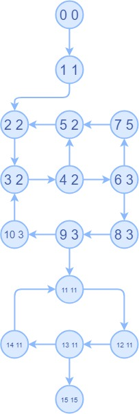
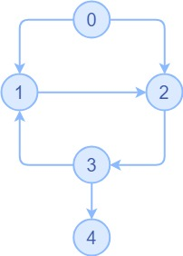
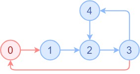
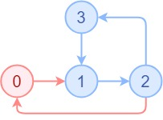

# Lab5 实验报告-阶段一

王经文 PB18111722

简子哲 PB17000008

李缙 PB17111572

## 实验要求

阅读代码并回答关于 LoopSearch 与 Mem2reg 的问题。

## 思考题
### LoopSearch

LoopSearch 的基本思路是：先找出一个函数的流图的所有极大强连通子集，然后找到这些强连通子集的根作为循环的开始。

删掉之前的根，再找极大强连通子集，作为内循环的根。

一直删、找，直到没有强连通子集为止。

1. 首先要了解 Tarjan 算法。

   按照深度优先搜索，每个点的 index 表示访问顺序（一个点只会被访问一次，因此 index 在被赋值后就不变了），另外还有一个值 lowlink，初值等于 index。

   lowlink 的修改规则是：如果搜索过程中前方的点没有被访问过，则在访问之后，取自己和前方点的 lowlink 中较小的一个作为自己的 lowlink；如果被访问过且和自己在同一个最外层循环中，则取自己的 lowlink 和前方点的 index 中较小的一个作为自己的 lowlink。

   

   上图中每个点的第一个值为 index，第二个值为 lowlink。首先程序会找到一个环（已经是一个强连通子集了），然后找起点和终点都在已有强连通子集上的路径，加入这个子集。最终，上图会输出两个循环，一个 index = {2, 3, 4, 5, 6, 7, 8, 9, 10}，一个 index = {11, 12, 13, 14}。

   对于一个给定的循环，满足以下两个条件的任意一个的循环内的点就是这个循环的根：这个点的某个父节点不属于循环，或者这个点是一个包含当前循环的大循环的根（已经被删掉了，删掉指删除这个点的所有相邻边）的子节点。

   对于由 cminus 直接生成的 ll 程序，每个循环只有一个根，因为 cminus 中没有跳转指令，从循环外进入循环时，必定先执行循环的第一步。

   如果不考虑 cminus 的限制，直接观察流图，可以找到如下反例：

   

   这个反例中，循环为 index = {1, 2, 3}，有 1、2 两个入口。但事实上 cminus 的流图不可能像这样，因此程序中不用考虑一个循环有多个根的情况。

2. 循环嵌套有两种情况：

   

   第一种是内循环不紧跟外循环的根节点。这里外循环是 {0, 1, 2, 3, 4}，根是 0；删除 0 号节点后得到内循环是 {2, 3, 4}。

   此时，遍历内循环的所有节点，查找有没有某个节点的某个父节点不属于内循环。2 号节点的父节点 1 号满足条件，所以 2 号是内循环的根节点。

   

   第二种是内循环紧跟外循环的根节点。这里外循环是 {0, 1, 2, 3}，根是 0；删除 0 号节点后得到内循环是 {1, 2, 3}。

   此时，遍历内循环的所有节点，查找有没有某个节点的某个父节点不属于内循环，没有找到。

   再看有没有已经被删掉的节点的子节点属于内循环。0 号节点的子节点 1 号满足要求，所以 1 号是内循环的根节点。

   出现第二种情况的原因是：我们要寻找进入强连通子集的那条边的尾部，作为子集的根（这里直接认为这条边唯一）。但对于内循环，这条边的头部可能连着外循环的根，因此这条边可能已经被删掉了，需要从已被删除的点出发，寻找这条边。


### Mem2reg
1. **x** 是 **n** 的支配边界中的元素，当且仅当 **x** 支配 **n** 的一个前驱结点，同时 **x** 并不严格支配 **n**

2. 由于静态赋值只能让变量赋值一次，在遇到有多个前驱的 BasicBlock 时，可能会出现同一变量有多个版本的问题，phi 节点就是为了解决这种问题的，我的理解就是控制流。

   例如：

   ```c
   a = 1;
   if (v < 10)
   	a = 2;
   b = a;
   ```

   此时要想确哪个版本的 a 给 b 赋值，就需要添加一个 phi node

   ```c
   a1 = 1;
   if (v < 10)
   	a2 = 2;
   b = phi（a1,a2);
   ```

3. 执行 pass 之前 `.ll` 文件里并非是完全的 SSA 形式，而是采取 `alloca/load/store` 等方法，将所有的局部变量通过 `“alloca”` 指令进行分配，所以可以进行多次定义，避免了 phi 函数产生的大量开销（构造 SSA 的算法时需要各种复杂的数据结构），但是由于每一次都需要访问内存，会导致很严重的性能问题。

   执行 pass 后将 `“alloca”` 的 IR 转为 SSA 形式。这个 pass 把 `alloca` 指令分配的栈变量转化成 SSA 寄存器，并且在合适的地方插入 PHI 结点，替代原来 main 函数中的交换语句。

   **对于本题**：在调用 `gcd（）` 传参时，通过 phi 进行控制流判断，比较出两个输入值的大小传入，不需要像原来 IR 一样再分配内存。

4. 算法遍历节点的所有支配边界，若在支配边界中找到了某变量，代表其可能在其它节点里有定义。

5. 维护 `value` 栈，在检测到 `store ` 指令时，将左值压栈。替换时用 `value` 栈顶值。

### 代码阅读总结

了解了如何调用 `LightIR` 的接口来开发优化 Pass。
